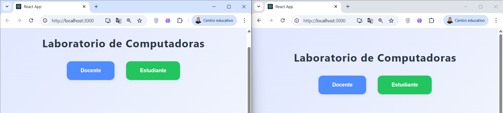
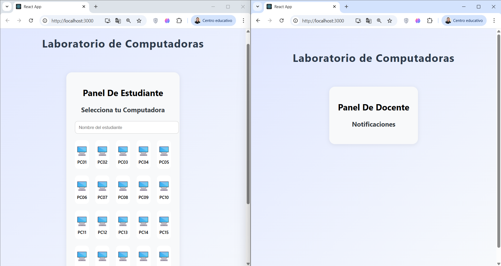
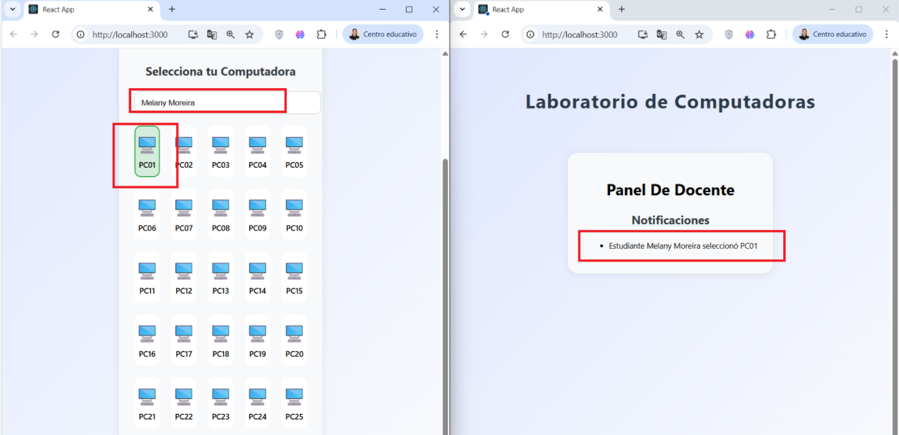
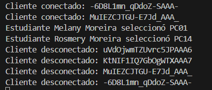

<table width="100%" border="0" cellspacing="0" cellpadding="4">
  <tr>
    <td width="20%" align="center" rowspan="2">
      
    </td>
    <td align="center" bgcolor="#f2f2f2" style="font-size:18px; font-weight:bold;" colspan="5">
      INFORME DE PRÁCTICA DE LABORATORIO
    </td>
  </tr>
  <tr></tr>
</table>

<table width="100%" border="1" cellspacing="0" cellpadding="4" style="border-collapse:collapse; font-size:13px;">
  <tr>
    <td bgcolor="#e6e6e6"><b>DEPARTAMENTO:</b></td>
    <td>Ciencias de la Computación</td>
    <td bgcolor="#e6e6e6"><b>CARRERA:</b></td>
    <td>Ingeniería en Tecnologías de la Información</td>
  </tr>
  <tr>
    <td bgcolor="#e6e6e6"><b>ASIGNATURA:</b></td>
    <td>Aplicaciones Distribuidas</td>
    <td bgcolor="#e6e6e6"><b>NIVEL:</b></td>
    <td>7mo</td>
    <td bgcolor="#e6e6e6"><b>FECHA:</b></td>
    <td>13/08/2025</td>
  </tr>
  <tr>
    <td bgcolor="#e6e6e6"><b>DOCENTE:</b></td>
    <td>Paulo Galarza</td>
    <td bgcolor="#e6e6e6"><b>PRÁCTICA N°:</b></td>
    <td>2</td>
    <td bgcolor="#e6e6e6"><b>CALIFICACIÓN:</b></td>
    <td></td>
  </tr>
</table>

# Implementación de Notificaciones en Tiempo Real con Socket.io para Registro de Computadoras en Laboratorio

**Melany Rosmery Moreira Zambrano**

---

## RESUMEN

Se desarrolló una aplicación web que permite a los estudiantes seleccionar una computadora en un laboratorio y notifica en tiempo real al docente sobre el registro realizado. Utilizando React para el frontend y Node.js con Socket.io para el backend, se estableció una comunicación bidireccional y persistente entre clientes y servidor. El sistema muestra visualmente las computadoras disponibles, permitiendo una experiencia intuitiva similar a la selección de asientos en cines. El docente recibe notificaciones emergentes instantáneas y puede visualizar el historial de registros. La consola del servidor y del cliente reflejan los eventos de conexión, desconexión y registro, facilitando la supervisión del flujo de la práctica. Esta solución fomenta la interacción dinámica y la disciplina en el laboratorio, optimizando la gestión de recursos y la comunicación entre usuarios.

**Palabras Claves:** Socket.io, Notificaciones, Laboratorio

---

## 1. INTRODUCCIÓN
La práctica se centra en la integración de tecnologías de comunicación en tiempo real para mejorar la gestión y disciplina en el laboratorio. Se busca que los estudiantes registren el equipo que utilizarán y que el docente reciba notificaciones inmediatas, promoviendo la transparencia y el control en el uso de los recursos.

## 2. OBJETIVO(S)
- Implementar un sistema de notificaciones en tiempo real usando Socket.io.
- Visualizar el registro de computadoras por parte de los estudiantes y la notificación instantánea al docente.

## 3. MARCO TEÓRICO
Socket.io es una biblioteca que permite la comunicación bidireccional en tiempo real entre clientes y servidores mediante WebSockets. Su uso en aplicaciones web facilita la actualización instantánea de interfaces y la transmisión eficiente de eventos, mejorando la experiencia del usuario y la interacción en sistemas distribuidos.

## 4. DESCRIPCIÓN DEL PROCEDIMIENTO
- Se creó un backend con Node.js, Express y Socket.io para gestionar las conexiones y eventos.
- El frontend se desarrolló en React, mostrando las computadoras en una cuadrícula visual e intuitiva.
- Los estudiantes seleccionan su computadora y el evento se transmite al docente en tiempo real.
- Se registran y muestran los eventos de conexión, desconexión y registro en las consolas correspondientes.

### Instalación de dependencias

```bash
# Backend
cd backend
npm install

# Frontend
cd ../frontend
npm install
```

### Estructura del proyecto

```
Lab2U3_MoreiraMelany/
├── backend/
│   ├── server.js
│   └── ...
├── frontend/
│   ├── src/
│   │   ├── App.js
│   │   ├── DocenteView.js
│   │   ├── EstudianteView.js
│   │   ├── App.css
│   │   └── ...
│   └── ...
└── README.md
```

### Ejecución

```bash
# Iniciar backend
cd backend
node server.js

# Iniciar frontend
cd ../frontend
npm start
```

---

## 5. ANÁLISIS DE RESULTADOS
Durante la ejecución, la consola del servidor muestra los clientes conectados, desconectados y los registros de computadoras:

```
Cliente conectado: <socket_id>
Estudiante Melany seleccionó PC01
Cliente desconectado: <socket_id>
```

La consola del navegador también refleja los eventos de conexión y notificación. El docente recibe notificaciones emergentes en tiempo real.

---

## 6. GRÁFICOS O FOTOGRAFÍAS
A continuación, se presentan capturas del sistema en funcionamiento:

<p align="center">
  
  
  
  
</p>

---

## 7. DISCUSIÓN
La integración de Socket.io permitió una comunicación eficiente y en tiempo real, mejorando la interacción entre los usuarios del laboratorio. La visualización tipo "asientos de cine" facilitó la selección y control de los recursos. Se evidenció la importancia de la retroalimentación instantánea y la supervisión activa en entornos educativos.

## 8. CONCLUSIONES
- Se logró implementar un sistema funcional de notificaciones en tiempo real.
- La experiencia de usuario fue mejorada mediante una interfaz visual e intuitiva.
- El monitoreo en consola facilitó la validación del flujo de eventos y la disciplina en el laboratorio.

## 9. BIBLIOGRAFÍA
- Socket.io. (2025). Socket.IO Documentation. https://socket.io/docs/
- React. (2025). React Documentation. https://react.dev/
- Node.js. (2025). Node.js Documentation. https://nodejs.org/en/docs/
